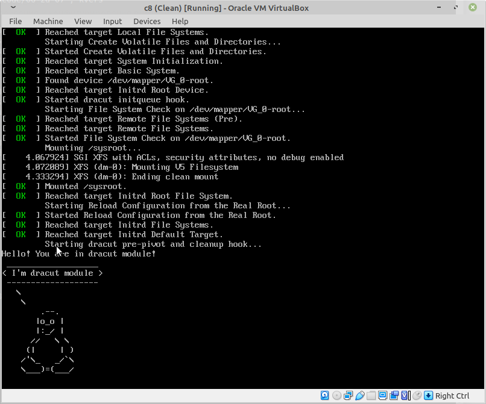

 <em>подпись к изображению</em>

## **Загрузка системы**

При выполнении задания использовалось следующее ПО:

##**Хост**
** ОС - Linux Mint 19.3 **
** Гипервизор - VirtualBox 6.1.6**
** Средство для создания и конфигурирования виртуальной среды - Vagrant 2.2.7 **
** Создание образа виртуальной машины - Packer 1.5.5 **
** Система контроля версий -  Git 2.26.2 **

##**Виртуальная машина**
** ОС - Centos 8.1 1911 **


## **Установка Centos 8.1 на диск с LVM**

Установим ОС для дальнейших действий действий с машиной. Сначала разметим диск:

 <em>разметка диска для установки ОС</em>

После разметки получаем на диске:
`/boot` - 300 MB
`swap` - 1 GB
Volume group `cl_c8` c разделами `/` и `home` на нем
`/` - 26 GB
`/home` - 3 GB

После установки окончания установки и загрузки системы диск выглядит так:

 <em>информация о разделах</em>

## **Переименования  VG**

Узнаем информацию о имеющихся `Volume Group`

```
[ian@c8 ~]$ sudo vgs
  VG    #PV #LV #SN Attr   VSize  VFree
  cl_c8   1   3   0 wz--n- 30,00g 4,00m
```

На виртуальной машине есть `Volume Group` с именем `cl_c8` Переименуем её в `VG_0`, для этого выполним команду:

```
[ian@c8 ~]$ sudo vgrename cl_c8 VG_0
  Volume group "cl_c8" successfully renamed to "VG_0"
```
`Volume Group` успешно переименована.

```
[ian@c8 ~]$ lsblk
NAME          MAJ:MIN RM  SIZE RO TYPE MOUNTPOINT
sda             8:0    0   32G  0 disk 
├─sda1          8:1    0  300M  0 part /boot
├─sda2          8:2    0   29G  0 part 
│ ├─VG_0-root 253:0    0   26G  0 lvm  /
│ └─VG_0-home 253:1    0    3G  0 lvm  /home
└─sda3          8:3    0    1G  0 part [SWAP]

```

Далее, необходимо внести изменения в файлы `/etc/fstab/`, `etc/default/grub`, `/boot/grub2/grub.cfg` изменив старое название `cl_c8` на новое `VG-0`

`/etc/fstab` до редактирования

```
# Created by anaconda on Sun May 24 08:22:49 2020
#
# Accessible filesystems, by reference, are maintained under '/dev/disk/'.
# See man pages fstab(5), findfs(8), mount(8) and/or blkid(8) for more info.
#
# After editing this file, run 'systemctl daemon-reload' to update systemd
# units generated from this file.
#
/dev/mapper/cl_c8-root  /                       xfs     defaults        0 0
UUID=7a3c0500-3ca3-4af6-979d-1bdd629a32ee /boot                   ext4    defaults        1 2
/dev/mapper/cl_c8-home  /home                   xfs     defaults        0 0
UUID=b5ab5c17-249c-4a23-adbb-fa713e82d1ba swap                    swap    defaults        0 0

```
`/etc/fstab`после редактирования

```
# Created by anaconda on Sun May 24 08:22:49 2020
#
# Accessible filesystems, by reference, are maintained under '/dev/disk/'.
# See man pages fstab(5), findfs(8), mount(8) and/or blkid(8) for more info.
#
# After editing this file, run 'systemctl daemon-reload' to update systemd
# units generated from this file.
#
/dev/mapper/VG_0-root  /                       xfs     defaults        0 0
UUID=7a3c0500-3ca3-4af6-979d-1bdd629a32ee /boot                   ext4    defaults        1 2
/dev/mapper/VG_0-home  /home                   xfs     defaults        0 0
UUID=b5ab5c17-249c-4a23-adbb-fa713e82d1ba swap                    swap    defaults        0 0

```
`/etc/default/grub` до редактирования
```
GRUB_TIMEOUT=5
GRUB_DISTRIBUTOR="$(sed 's, release .*$,,g' /etc/system-release)"
GRUB_DEFAULT=saved
GRUB_DISABLE_SUBMENU=true
GRUB_TERMINAL_OUTPUT="console"
GRUB_CMDLINE_LINUX="resume=UUID=b5ab5c17-249c-4a23-adbb-fa713e82d1ba rd.lvm.lv=cl_c8/root "
GRUB_DISABLE_RECOVERY="true"
GRUB_ENABLE_BLSCFG=true
```

`/etc/default/grub`после редактирования
```
GRUB_TIMEOUT=5
GRUB_DISTRIBUTOR="$(sed 's, release .*$,,g' /etc/system-release)"
GRUB_DEFAULT=saved
GRUB_DISABLE_SUBMENU=true
GRUB_TERMINAL_OUTPUT="console"
GRUB_CMDLINE_LINUX="resume=UUID=b5ab5c17-249c-4a23-adbb-fa713e82d1ba rd.lvm.lv=VG_0/root "
GRUB_DISABLE_RECOVERY="true"
GRUB_ENABLE_BLSCFG=true
```

/boot/grub2/grub.cfg  до редактирования

```
...
set default_kernelopts="root=/dev/mapper/cl_c8-root ro resume=UUID=b5ab5c17-249c-4a23-adbb-fa713e82d1ba rd.lvm.lv=cl_c8/root rhgb quiet "

...
```

/boot/grub2/grub.cfg  после редактирования

```
...
set default_kernelopts="root=/dev/mapper/VG_0-root ro resume=UUID=b5ab5c17-249c-4a23-adbb-fa713e82d1ba rd.lvm.lv=VG_0/root "
...
```

Активируем `Volume Group`
```
[ian@c8 ~]$ sudo vgchange -ay
  2 logical volume(s) in volume group "VG_0" now active
```

Обновляем атрибуты

```
[ian@c8 ~]$ sudo lvchange /dev/mapper/VG_0-root --refresh
[ian@c8 ~]$ sudo lvchange /dev/mapper/VG_0-home --refresh

```

После этого необходимо обновить образ `initrd`

```
[ian@c8 ~]$ sudo dracut -v -f /boot/initramfs-$(uname -r).img $(uname -r)
dracut: Executing: /usr/bin/dracut -v -f /boot/initramfs-4.18.0-147.8.1.el8_1.x86_64.img 4.18.0-147.8.1.el8_1.x86_64
dracut: dracut module 'modsign' will not be installed, because command 'keyctl' could not be found!
dracut: dracut module 'busybox' will not be installed, because command 'busybox' could not be found!
dracut: dracut module 'btrfs' will not be installed, because command 'btrfs' could not be found!
dracut: dracut module 'dmraid' will not be installed, because command 'dmraid' could not be found!
dracut: dracut module 'mdraid' will not be installed, because command 'mdadm' could not be found!
dracut: dracut module 'stratis' will not be installed, because command 'stratisd-init' could not be found!
dracut: dracut module 'cifs' will not be installed, because command 'mount.cifs' could not be found!
dracut: dracut module 'iscsi' will not be installed, because command 'iscsi-iname' could not be found!
dracut: dracut module 'iscsi' will not be installed, because command 'iscsiadm' could not be found!
dracut: dracut module 'iscsi' will not be installed, because command 'iscsid' could not be found!
dracut: 95nfs: Could not find any command of 'rpcbind portmap'!
dracut: dracut module 'modsign' will not be installed, because command 'keyctl' could not be found!
dracut: dracut module 'busybox' will not be installed, because command 'busybox' could not be found!
dracut: dracut module 'btrfs' will not be installed, because command 'btrfs' could not be found!
dracut: dracut module 'dmraid' will not be installed, because command 'dmraid' could not be found!
dracut: dracut module 'mdraid' will not be installed, because command 'mdadm' could not be found!
dracut: dracut module 'stratis' will not be installed, because command 'stratisd-init' could not be found!
dracut: dracut module 'cifs' will not be installed, because command 'mount.cifs' could not be found!
dracut: dracut module 'iscsi' will not be installed, because command 'iscsi-iname' could not be found!
dracut: dracut module 'iscsi' will not be installed, because command 'iscsiadm' could not be found!
dracut: dracut module 'iscsi' will not be installed, because command 'iscsid' could not be found!
dracut: 95nfs: Could not find any command of 'rpcbind portmap'!
dracut: *** Including module: bash ***
dracut: *** Including module: systemd ***
dracut: *** Including module: systemd-initrd ***
dracut: *** Including module: rngd ***
dracut: *** Including module: i18n ***
dracut: *** Including module: network-legacy ***
dracut: *** Including module: network ***
dracut: *** Including module: ifcfg ***
dracut: *** Including module: drm ***
dracut: *** Including module: plymouth ***
dracut: *** Including module: prefixdevname ***
dracut: *** Including module: dm ***
dracut: Skipping udev rule: 64-device-mapper.rules
dracut: Skipping udev rule: 60-persistent-storage-dm.rules
dracut: Skipping udev rule: 55-dm.rules
dracut: *** Including module: kernel-modules ***
dracut: *** Including module: kernel-modules-extra ***
dracut: *** Including module: kernel-network-modules ***
dracut: *** Including module: lvm ***
dracut: Skipping udev rule: 64-device-mapper.rules
dracut: Skipping udev rule: 56-lvm.rules
dracut: Skipping udev rule: 60-persistent-storage-lvm.rules
dracut: *** Including module: resume ***
dracut: *** Including module: rootfs-block ***
dracut: *** Including module: terminfo ***
dracut: *** Including module: udev-rules ***
dracut: Skipping udev rule: 91-permissions.rules
dracut: Skipping udev rule: 80-drivers-modprobe.rules
dracut: *** Including module: biosdevname ***
dracut: *** Including module: dracut-systemd ***
dracut: *** Including module: usrmount ***
dracut: *** Including module: base ***
dracut: *** Including module: fs-lib ***
dracut: *** Including module: microcode_ctl-fw_dir_override ***
dracut:   microcode_ctl module: mangling fw_dir
dracut:     microcode_ctl: reset fw_dir to "/lib/firmware/updates /lib/firmware"
dracut:     microcode_ctl: processing data directory  "/usr/share/microcode_ctl/ucode_with_caveats/intel"...
intel: model '', path ' intel-ucode/*', kvers ''
intel: blacklist ''
dracut:     microcode_ctl: intel: Host-Only mode is enabled and "intel-ucode/06-9e-09" matches "intel-ucode/*"
dracut:       microcode_ctl: intel: caveats check for kernel version "4.18.0-147.8.1.el8_1.x86_64" passed, adding "/usr/share/microcode_ctl/ucode_with_caveats/intel" to fw_dir variable
dracut:     microcode_ctl: processing data directory  "/usr/share/microcode_ctl/ucode_with_caveats/intel-06-2d-07"...
intel-06-2d-07: model 'GenuineIntel 06-2d-07', path ' intel-ucode/06-2d-07', kvers ''
intel-06-2d-07: blacklist ''
intel-06-2d-07: caveat is disabled in configuration
dracut:     microcode_ctl: kernel version "4.18.0-147.8.1.el8_1.x86_64" failed early load check for "intel-06-2d-07", skipping
dracut:     microcode_ctl: processing data directory  "/usr/share/microcode_ctl/ucode_with_caveats/intel-06-4f-01"...
intel-06-4f-01: model 'GenuineIntel 06-4f-01', path ' intel-ucode/06-4f-01', kvers ' 4.17.0 3.10.0-894 3.10.0-862.6.1 3.10.0-693.35.1 3.10.0-514.52.1 3.10.0-327.70.1 2.6.32-754.1.1 2.6.32-573.58.1 2.6.32-504.71.1 2.6.32-431.90.1 2.6.32-358.90.1'
intel-06-4f-01: blacklist ''
intel-06-4f-01: caveat is disabled in configuration
dracut:     microcode_ctl: kernel version "4.18.0-147.8.1.el8_1.x86_64" failed early load check for "intel-06-4f-01", skipping
dracut:     microcode_ctl: processing data directory  "/usr/share/microcode_ctl/ucode_with_caveats/intel-06-55-04"...
intel-06-55-04: model 'GenuineIntel 06-55-04', path ' intel-ucode/06-55-04', kvers ''
intel-06-55-04: blacklist ''
intel-06-55-04: caveat is disabled in configuration
dracut:     microcode_ctl: kernel version "4.18.0-147.8.1.el8_1.x86_64" failed early load check for "intel-06-55-04", skipping
dracut:     microcode_ctl: final fw_dir: "/usr/share/microcode_ctl/ucode_with_caveats/intel /lib/firmware/updates /lib/firmware"
dracut: *** Including module: shutdown ***
dracut: *** Including modules done ***
dracut: *** Installing kernel module dependencies ***
dracut: *** Installing kernel module dependencies done ***
dracut: *** Resolving executable dependencies ***
dracut: *** Resolving executable dependencies done***
dracut: *** Hardlinking files ***
dracut: *** Hardlinking files done ***
dracut: Could not find 'strip'. Not stripping the initramfs.
dracut: *** Generating early-microcode cpio image ***
dracut: *** Constructing GenuineIntel.bin ****
dracut: *** Constructing GenuineIntel.bin ****
dracut: *** Store current command line parameters ***
dracut: *** Creating image file '/boot/initramfs-4.18.0-147.8.1.el8_1.x86_64.img' ***
dracut: *** Creating initramfs image file '/boot/initramfs-4.18.0-147.8.1.el8_1.x86_64.img' done ***
```

К сожалению, при попытке обновления записи grub происходила ошибка

```
[ian@c8 ~]$ sudo grub2-mkconfig -o /boot/grub2/grub.cfg
/usr/sbin/grub2-probe: error: failed to get canonical path of `/dev/mapper/cl_c8-root'.
```
Хотя устройство было переименовано обновить запись не получалось, перезагружаем машину.

ОС отказывалась загружаться. В меню загрузки наживаем клавишу `e`

 
<em>Запись в меню загрузки</em>

Для загрузки потребовалось указать верное наименование `VG` - `VG-0`, после этого ОС загрузилась.

Пробуем повторно сгенерировать меню, на этот раз операция удается

```
[ian@c8 ~]$ sudo grub2-mkconfig -o /boot/grub2/grub.cfg
Generating grub configuration file ...
done
```
Перезагружаемся

 

На этот раз меню успешно обновилось и в дальнейшем ОС будет загружаться успешно

## **Смена неизвестного пароля root**

## **Метод 1**

Для этого потребуется отредактировать загрузочное меню добавив в конец строки `rd.break`


После выполнения загружки попадаем в аварийный режим


Монтириуем файловую систему из режима ro в rw


Подключем директорию `/sysroot` как `/`


Изменяем пароль


Для обновления атрибутов безопастности создадим в корне раздела `/` файл `.autorelabel`

```
touch /.autorelabel
```

## **Метод 2**

Как и в первом методе, редактируем загрузочное меню

Изменяем режим с `ro` на `rw` и добавляем после нее `init=/sysroot/bin/sh` и загружаемся в этой конфигурации


После загрузки получаем сразу файловую систему смотированую в режиме `rw`


Далее последовательность действия такая-же

```
chroot /sysroot
```

```
passwd root
```
После успешной смены пароля создаем в корне раздела `/` файл `.autorelabel`

```
touch /.autorelabel
```

## **Добавление модуля в initrd**

Создадим для модуля директорию

```
[ian@c8 ~]$ sudo mkdir /usr/lib/dracut/modules.d/01test
```
Добавляем в директорию скрипт `module-setup.sh` - который установит и будет вызывать модуль

```
#!/bin/bash

check() {
    return 0
}

depends() {
    return 0
}

install() {
    inst_hook cleanup 00 "${moddir}/test.sh"
}
```

И `test.sh` - сам модуль

```
#!/bin/bash

exec 0<>/dev/console 1<>/dev/console 2<>/dev/console
cat <<'msgend'
Hello! You are in dracut module!
 ___________________
< I'm dracut module >
 -------------------
   \
    \
        .--.
       |o_o |
       |:_/ |
      //   \ \
     (|     | )
    /'\_   _/`\
    \___)=(___/
msgend
sleep 10
echo " continuing...."
```
Пересобираем образ initrd

```
[ian@c8 ~]$ sudo dracut -f -v /boot/initramfs-$(uname -r).img $(uname -r)
dracut: Executing: /usr/bin/dracut -f -v /boot/initramfs-4.18.0-147.8.1.el8_1.x86_64.img 4.18.0-147.8.1.el8_1.x86_64
dracut: dracut module 'modsign' will not be installed, because command 'keyctl' could not be found!
dracut: dracut module 'busybox' will not be installed, because command 'busybox' could not be found!
dracut: dracut module 'btrfs' will not be installed, because command 'btrfs' could not be found!
dracut: dracut module 'dmraid' will not be installed, because command 'dmraid' could not be found!
dracut: dracut module 'mdraid' will not be installed, because command 'mdadm' could not be found!
dracut: dracut module 'stratis' will not be installed, because command 'stratisd-init' could not be found!
dracut: dracut module 'cifs' will not be installed, because command 'mount.cifs' could not be found!
dracut: dracut module 'iscsi' will not be installed, because command 'iscsi-iname' could not be found!
dracut: dracut module 'iscsi' will not be installed, because command 'iscsiadm' could not be found!
dracut: dracut module 'iscsi' will not be installed, because command 'iscsid' could not be found!
dracut: 95nfs: Could not find any command of 'rpcbind portmap'!
dracut: dracut module 'modsign' will not be installed, because command 'keyctl' could not be found!
dracut: dracut module 'busybox' will not be installed, because command 'busybox' could not be found!
dracut: dracut module 'btrfs' will not be installed, because command 'btrfs' could not be found!
dracut: dracut module 'dmraid' will not be installed, because command 'dmraid' could not be found!
dracut: dracut module 'mdraid' will not be installed, because command 'mdadm' could not be found!
dracut: dracut module 'stratis' will not be installed, because command 'stratisd-init' could not be found!
dracut: dracut module 'cifs' will not be installed, because command 'mount.cifs' could not be found!
dracut: dracut module 'iscsi' will not be installed, because command 'iscsi-iname' could not be found!
dracut: dracut module 'iscsi' will not be installed, because command 'iscsiadm' could not be found!
dracut: dracut module 'iscsi' will not be installed, because command 'iscsid' could not be found!
dracut: 95nfs: Could not find any command of 'rpcbind portmap'!
dracut: *** Including module: bash ***
dracut: *** Including module: systemd ***
dracut: *** Including module: systemd-initrd ***
dracut: *** Including module: test ***
dracut: *** Including module: rngd ***
dracut: *** Including module: i18n ***
dracut: *** Including module: network-legacy ***
dracut: *** Including module: network ***
dracut: *** Including module: ifcfg ***
dracut: *** Including module: drm ***
dracut: *** Including module: plymouth ***
dracut: *** Including module: prefixdevname ***
dracut: *** Including module: dm ***
dracut: Skipping udev rule: 64-device-mapper.rules
dracut: Skipping udev rule: 60-persistent-storage-dm.rules
dracut: Skipping udev rule: 55-dm.rules
dracut: *** Including module: kernel-modules ***
dracut: *** Including module: kernel-modules-extra ***
dracut: *** Including module: kernel-network-modules ***
dracut: *** Including module: lvm ***
dracut: Skipping udev rule: 64-device-mapper.rules
dracut: Skipping udev rule: 56-lvm.rules
dracut: Skipping udev rule: 60-persistent-storage-lvm.rules
dracut: *** Including module: resume ***
dracut: *** Including module: rootfs-block ***
dracut: *** Including module: terminfo ***
dracut: *** Including module: udev-rules ***
dracut: Skipping udev rule: 91-permissions.rules
dracut: Skipping udev rule: 80-drivers-modprobe.rules
dracut: *** Including module: biosdevname ***
dracut: *** Including module: dracut-systemd ***
dracut: *** Including module: usrmount ***
dracut: *** Including module: base ***
dracut: *** Including module: fs-lib ***
dracut: *** Including module: microcode_ctl-fw_dir_override ***
dracut:   microcode_ctl module: mangling fw_dir
dracut:     microcode_ctl: reset fw_dir to "/lib/firmware/updates /lib/firmware"
dracut:     microcode_ctl: processing data directory  "/usr/share/microcode_ctl/ucode_with_caveats/intel"...
intel: model '', path ' intel-ucode/*', kvers ''
intel: blacklist ''
dracut:     microcode_ctl: intel: Host-Only mode is enabled and "intel-ucode/06-9e-09" matches "intel-ucode/*"
dracut:       microcode_ctl: intel: caveats check for kernel version "4.18.0-147.8.1.el8_1.x86_64" passed, adding "/usr/share/microcode_ctl/ucode_with_caveats/intel" to fw_dir variable
dracut:     microcode_ctl: processing data directory  "/usr/share/microcode_ctl/ucode_with_caveats/intel-06-2d-07"...
intel-06-2d-07: model 'GenuineIntel 06-2d-07', path ' intel-ucode/06-2d-07', kvers ''
intel-06-2d-07: blacklist ''
intel-06-2d-07: caveat is disabled in configuration
dracut:     microcode_ctl: kernel version "4.18.0-147.8.1.el8_1.x86_64" failed early load check for "intel-06-2d-07", skipping
dracut:     microcode_ctl: processing data directory  "/usr/share/microcode_ctl/ucode_with_caveats/intel-06-4f-01"...
intel-06-4f-01: model 'GenuineIntel 06-4f-01', path ' intel-ucode/06-4f-01', kvers ' 4.17.0 3.10.0-894 3.10.0-862.6.1 3.10.0-693.35.1 3.10.0-514.52.1 3.10.0-327.70.1 2.6.32-754.1.1 2.6.32-573.58.1 2.6.32-504.71.1 2.6.32-431.90.1 2.6.32-358.90.1'
intel-06-4f-01: blacklist ''
intel-06-4f-01: caveat is disabled in configuration
dracut:     microcode_ctl: kernel version "4.18.0-147.8.1.el8_1.x86_64" failed early load check for "intel-06-4f-01", skipping
dracut:     microcode_ctl: processing data directory  "/usr/share/microcode_ctl/ucode_with_caveats/intel-06-55-04"...
intel-06-55-04: model 'GenuineIntel 06-55-04', path ' intel-ucode/06-55-04', kvers ''
intel-06-55-04: blacklist ''
intel-06-55-04: caveat is disabled in configuration
dracut:     microcode_ctl: kernel version "4.18.0-147.8.1.el8_1.x86_64" failed early load check for "intel-06-55-04", skipping
dracut:     microcode_ctl: final fw_dir: "/usr/share/microcode_ctl/ucode_with_caveats/intel /lib/firmware/updates /lib/firmware"
dracut: *** Including module: shutdown ***
dracut: *** Including modules done ***
dracut: *** Installing kernel module dependencies ***
dracut: *** Installing kernel module dependencies done ***
dracut: *** Resolving executable dependencies ***
dracut: *** Resolving executable dependencies done***
dracut: *** Hardlinking files ***
dracut: *** Hardlinking files done ***
dracut: Could not find 'strip'. Not stripping the initramfs.
dracut: *** Generating early-microcode cpio image ***
dracut: *** Constructing GenuineIntel.bin ****
dracut: *** Constructing GenuineIntel.bin ****
dracut: *** Store current command line parameters ***
dracut: *** Creating image file '/boot/initramfs-4.18.0-147.8.1.el8_1.x86_64.img' ***
dracut: *** Creating initramfs image file '/boot/initramfs-4.18.0-147.8.1.el8_1.x86_64.img' done ***
```

Отредактирем `/boot/grub2/grub.cfg` убрав из него параметры rhgb quiet приведя строку к виду

```
...
set default_kernelopts="root=/dev/mapper/VG_0-root ro resume=UUID=b5ab5c17-249c-4a23-adbb-fa713e82d1ba rd.lvm.lv=VG_0/root "
...
```

И обоновив меню загрузки

```
sudo grub2-mkconfig -o /boot/grub2/grub.cfg
```

Теперь при загрузке появляется пингвинчик из модуля

 

